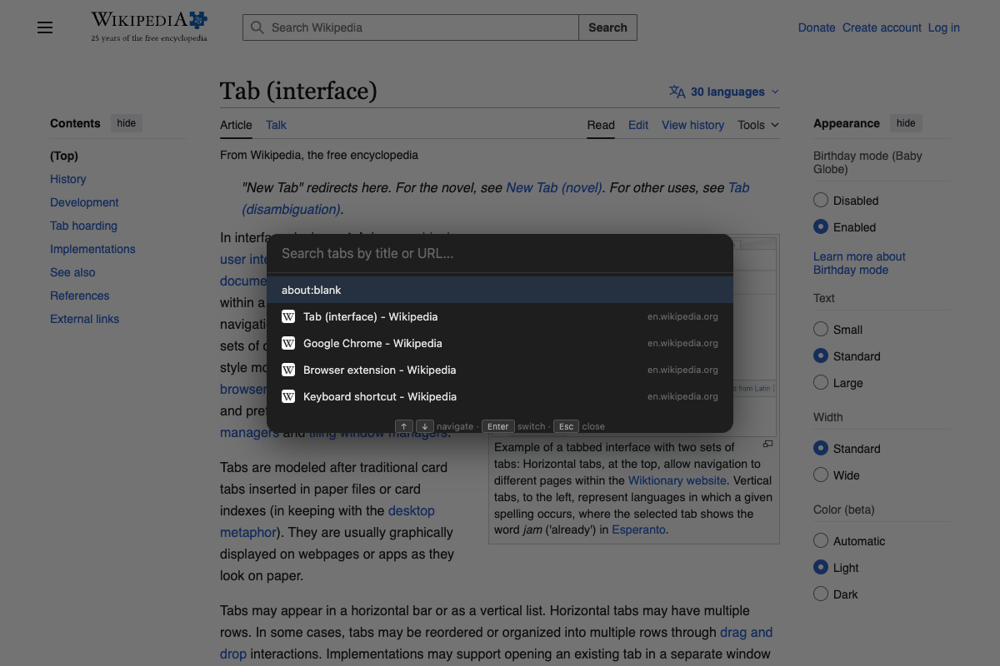
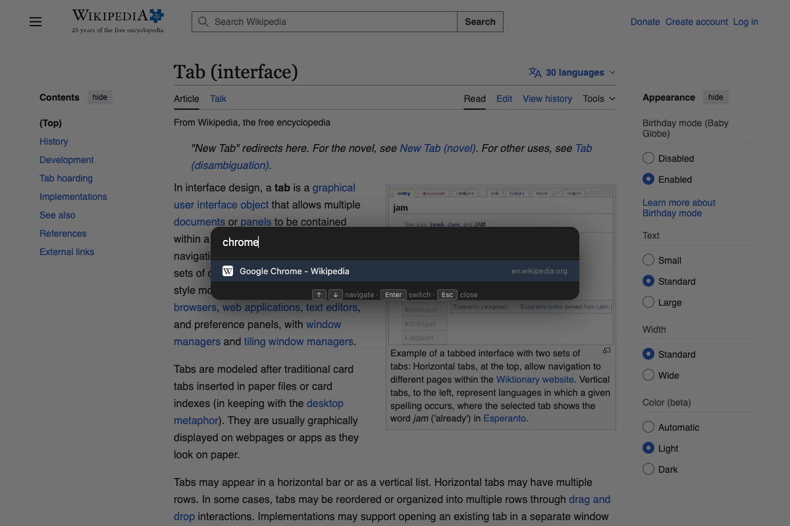
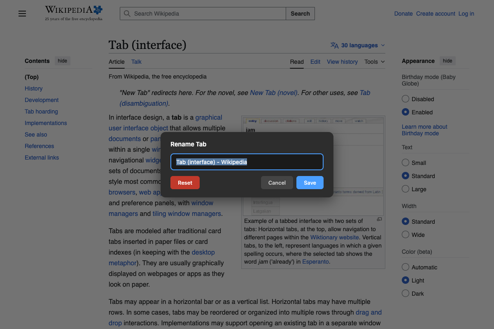
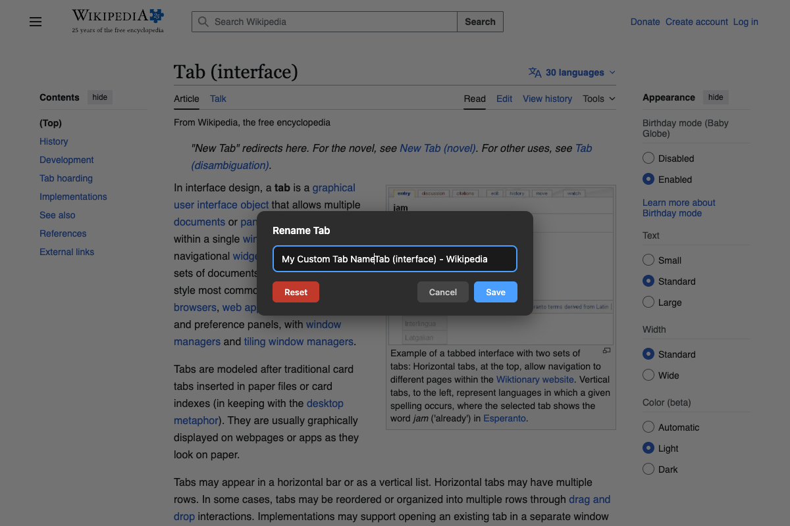
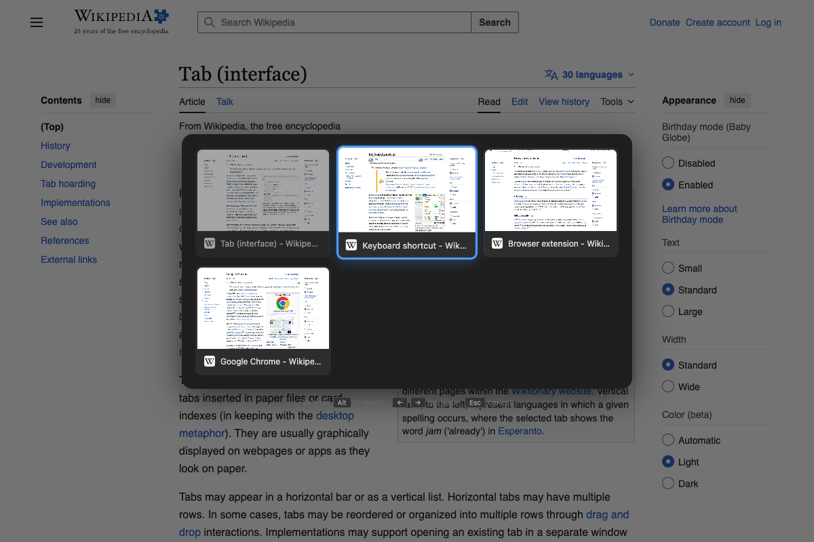
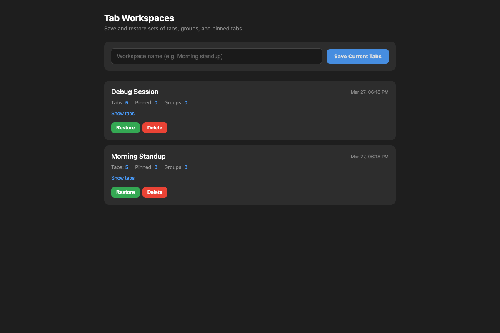
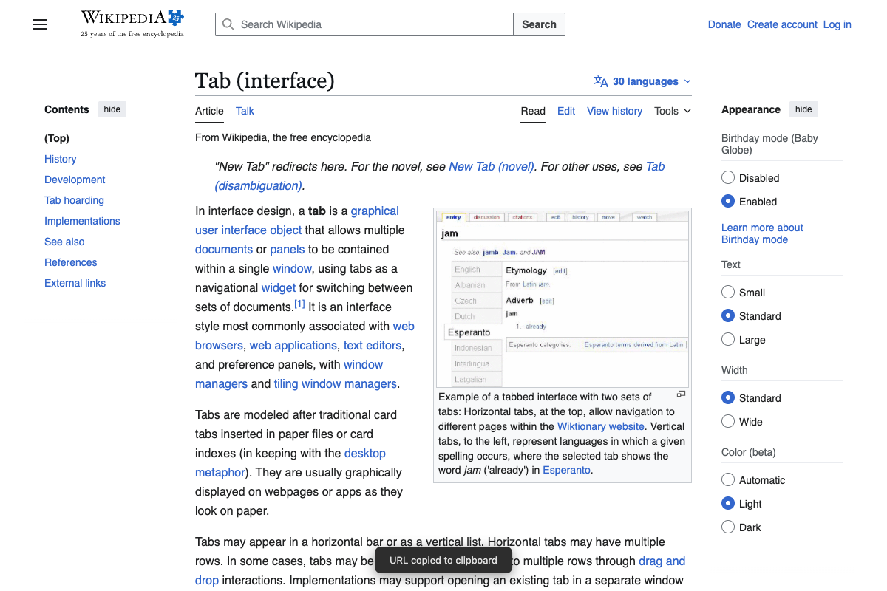
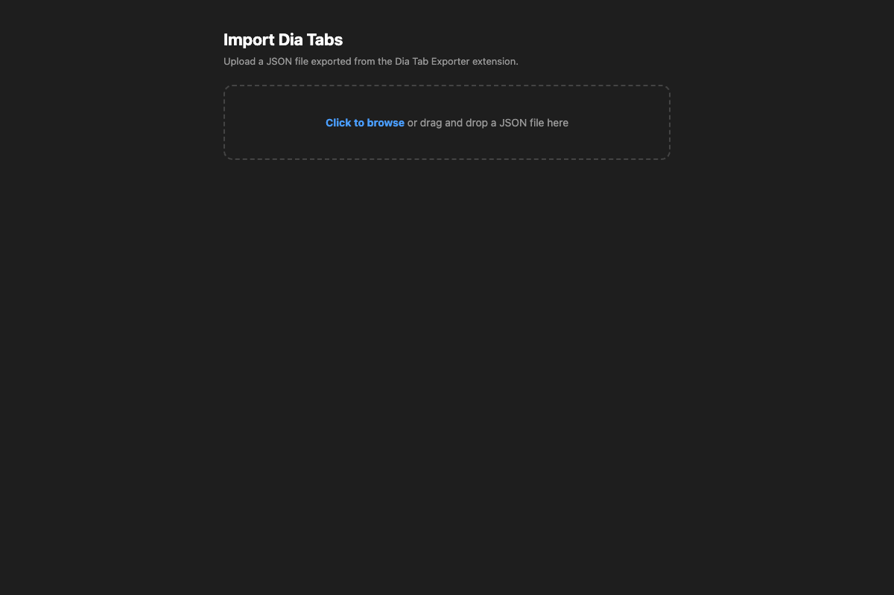

# Tab Manager - Rename & Switch

A Chrome extension for power users who need better tab management. Built for organizations that don't allow external extensions from the Chrome Web Store — load it locally in developer mode.

**No build step. No dependencies. Just load and go.**

## Features

### Tab Search (Cmd+K)

Fuzzy search across all open tabs by title or URL. Like Spotlight, but for your browser tabs.



- **Cmd+K** — open search overlay
- Type to filter tabs instantly
- **Arrow keys** navigate results
- **Enter** switches to selected tab
- **Escape** closes
- Searches across all windows



### Tab Renaming

Rename any tab to identify it easily. The custom name appears in the tab bar and persists across page reloads.



- **Alt+R** — open rename dialog
- **Right-click page** — "Rename Tab" in context menu
- **Click extension icon** — opens rename dialog
- **Reset** button restores the original title
- A MutationObserver protects the custom title from being overwritten by the page (e.g., Gmail changing its title for unread count)



### MRU Tab Switcher

A visual overlay showing your 6 most recently used tabs in a 3x2 grid with live thumbnails. Like Alt+Tab for your browser.



- **Alt+S** — open switcher (forward)
- Repeated presses advance the selection
- **Arrow keys** navigate the grid
- **Enter** switches to selected tab
- **Escape** cancels
- Releasing the Alt key auto-switches to the highlighted tab
- Thumbnails are captured automatically as you visit tabs

### Tab Workspaces

Save and restore named sets of tabs — including groups and pinned tabs. Perfect for switching between projects or saving your "morning standup" tabs.



- **Cmd+Shift+W** — quick save current tabs with a name prompt
- **Right-click** → "Tab Workspaces..." — opens the full management page
- **Restore** reopens all tabs, recreates named/colored tab groups, and pins tabs
- **Delete** removes a saved workspace
- Persists across browser restarts

### Pinned URLs

Automatically saves the URL when a tab is pinned or added to a tab group. Navigate back anytime, even after browsing elsewhere.

- **Alt+P** — navigate back to pinned URL
- **Right-click** — "Back to Pinned URL" (shows the saved hostname)
- **Right-click** — "Set Current URL as Pinned" (override the saved URL)
- Works with both Chrome's pinned tabs and tab groups
- URLs are saved at the exact moment a tab is pinned/grouped

### Copy URL

- **Cmd+Shift+C** — copies the current tab's URL to clipboard with a toast confirmation



### Tab Navigation (Vertical Tabs)

For users with Chrome's vertical tab strip:

- **Ctrl+Option+Up** — go one tab up
- **Ctrl+Option+Down** — go one tab down

### Other Shortcuts

- **Cmd+E** — duplicate current tab

### Context Menu

Right-click anywhere on a page to access Tab Manager features.


### Import from Dia Browser

Migrate tabs and groups from the [Dia browser](https://dia.dev) to Chrome using the included Dia Tab Exporter tool.



## Installation

1. Clone or download this repository:
   ```bash
   git clone https://github.com/talaviad-cmyk/chrome-tab-manager.git
   ```
2. Open [`chrome://extensions`](chrome://extensions) in Chrome
3. Enable **Developer mode** (top right toggle)
4. Click **Load unpacked**
5. Select the cloned folder

## Keyboard Shortcuts

> **Customize shortcuts:** open [`chrome://extensions/shortcuts`](chrome://extensions/shortcuts) to remap any shortcut to your preference.

| Action | Default Shortcut | Customizable |
|--------|-----------------|-------------|
| Tab search | Cmd+K | Via content script |
| Tab switcher (forward) | Alt+S | [Yes](chrome://extensions/shortcuts) |
| Tab switcher (backward) | — | [Set in shortcuts](chrome://extensions/shortcuts) |
| Rename tab | Alt+R | [Yes](chrome://extensions/shortcuts) |
| Quick save workspace | Cmd+Shift+W | Via content script |
| Duplicate tab | Cmd+E | [Yes](chrome://extensions/shortcuts) |
| Back to pinned URL | Alt+P | [Yes](chrome://extensions/shortcuts) |
| Set current URL as pinned | — | [Set in shortcuts](chrome://extensions/shortcuts) |
| Go one tab up | Ctrl+Option+Up | Via content script |
| Go one tab down | Ctrl+Option+Down | Via content script |
| Copy URL | Cmd+Shift+C | Via content script |

**Note:** Chrome reserves Ctrl+Tab and it cannot be overridden by extensions.

## Recommended: Enable Vertical Tabs

This extension works great with Chrome's built-in vertical tab strip, especially with Ctrl+Option+Up/Down navigation.

To enable vertical tabs in Chrome:

1. Open Chrome Settings (Cmd+,)
2. Go to **Appearance** in the left sidebar
3. Find **"Tab strip"** or **"Tab layout"**
4. Select **"Vertical"**

Or navigate directly to [`chrome://settings/appearance`](chrome://settings/appearance).

Vertical tabs give you:
- More visible tab titles (no truncation)
- Tab groups displayed as collapsible sections
- Better overview of all open tabs
- Natural pairing with Ctrl+Option+Up/Down navigation from this extension

## File Structure

```
chrome-tab-manager/
├── manifest.json          # MV3 extension manifest
├── background.js          # Service worker: MRU, thumbnails, commands, pinned URLs
├── content.js             # Content script: Shadow DOM overlays (search, switcher, rename)
├── content.css            # Styles injected into Shadow DOM
├── workspaces.html        # Tab workspaces management page
├── workspaces.js          # Workspace save/restore logic
├── import.html            # Dia tabs import page
├── import.js              # Import logic (creates tabs/groups in Chrome)
├── icons/                 # Extension icons (16/32/48/128px)
├── docs/                  # Screenshots for README
│
├── dia-exporter/          # Separate extension for Dia browser
│   ├── manifest.json
│   ├── background.js
│   ├── export.html
│   └── export.js
│
├── test-extension.js      # Playwright visual test script
├── test-workspaces.js     # Playwright workspaces test
├── .mcp.json              # Playwright MCP config for Claude Code
├── .claude/skills/        # Claude Code skills for development
├── CLAUDE.md              # Project context for Claude Code
└── README.md
```

## Dia Browser Migration

Dia uses a proprietary tab group system not accessible via Chrome APIs. To migrate:

1. Load `dia-exporter/` as an unpacked extension in Dia
2. Click the extension icon — opens a full page listing all tabs
3. Select tabs and use "Create Group from Selected" / "Mark Selected as Pinned"
4. Enter your profile name and click "Export JSON"
5. In Chrome, right-click any page → Tab Manager → "Import Dia Tabs..."
6. Upload the JSON file — tabs, groups, and pinned tabs are recreated

## Contributing

1. Fork the repository
2. Create a feature branch
3. Make your changes
4. Test by loading the unpacked extension in Chrome
5. Submit a pull request

### Development

No build step required — the extension runs directly from source.

To test changes:
1. Edit any file
2. Click the refresh icon on the extension card in [`chrome://extensions`](chrome://extensions)
3. Reload any open tab to get the updated content script
4. Check the service worker console for errors (click "service worker" link)

### Visual Testing with Playwright

The project includes Playwright test scripts for visual verification:

```bash
npm install playwright    # one-time setup
node test-extension.js    # launches Chromium with extension loaded, takes screenshots
```

### Claude Code Skills

This project includes [Claude Code](https://claude.ai/code) skills for development:

| Skill | Description |
|-------|-------------|
| `/add-feature` | Scaffolds a new feature end-to-end |
| `/add-shortcut` | Adds a keyboard shortcut with the right approach |
| `/validate-extension` | Validates manifest, files, and commands |
| `/test-feature` | Visual testing with Playwright |
| `/release` | Bumps version, tags, and pushes |

Key things to know:
- The service worker (`background.js`) is ephemeral — never store state in module-level variables, always use `chrome.storage`
- The content script UI lives in a closed Shadow DOM to avoid CSS conflicts
- CSS is loaded into the Shadow DOM via `fetch()`, not the manifest's `css` field
- Chrome limits extensions to 4 `suggested_key` shortcuts — additional shortcuts use content script keydown listeners

## License

MIT
